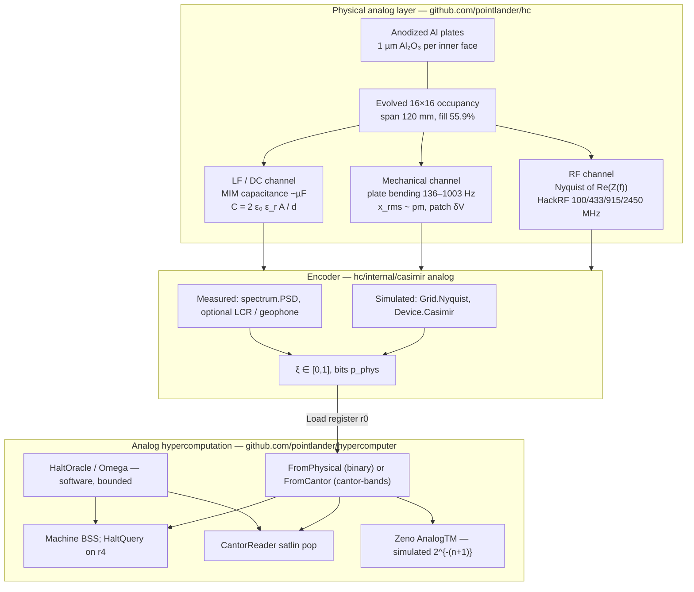
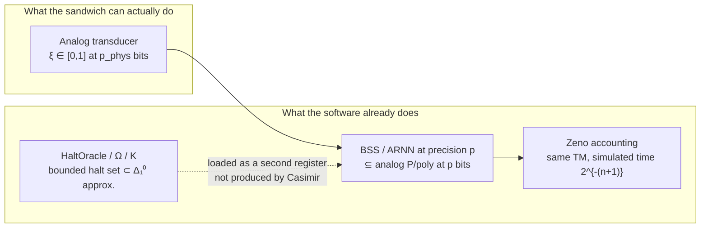
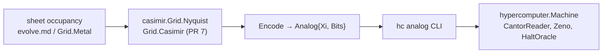
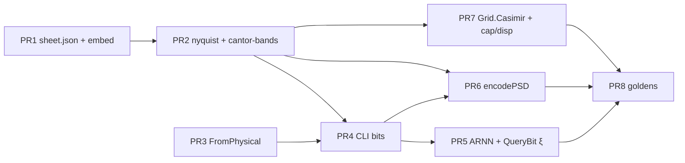

# Casimir Analog Hypercomputer

| | |
| --- | --- |
| **Title** | Casimir Analog Hypercomputer |
| **Author** | HC Authors |
| **Date** | 2026-09-17 |
| **Status** | Draft |
| **Repos** | [`github.com/pointlander/hc`](https://github.com/pointlander/hc), [`github.com/pointlander/hypercomputer`](https://github.com/pointlander/hypercomputer) |

---

## Overview

This document designs a **Casimir analog hypercomputer**: a two-layer machine that uses the already-modeled Al / Al₂O₃ / Al sandwich in `github.com/pointlander/hc` as a physical analog resource, and the already-implemented BSS / Cantor / Zeno / ARNN stack in `github.com/pointlander/hypercomputer` as the analog computation layer.

The Casimir sandwich is **not** a halt oracle. The vacuum-mode continuum between the plates is an analog object with infinitely many electromagnetic modes; a measurement of that object is a real in \([0,1]\) with finitely many physically meaningful bits. Those bits are loaded into `hypercomputer.BitFloat` and consumed by the existing register machine, Siegelmann–Sontag net, and (simulated) Zeno machine. Bounded halt-set and Chaitin Ω oracles remain **software encodings** (`HaltOracle`, `Omega`), exactly as they are today. The Casimir device supplies an analog register and a physical random/continuum source; it does not decide the halting problem.

The architecture an engineer can implement across the two repos is:

1. **Physical / analog layer** (`hc`): evolved 16×16 occupancy sheet, 1 µm Al₂O₃ MIM gaps, three instrumented channels (RF Nyquist, mechanical kHz, capacitance / gap), optional HackRF One probe readout.
2. **Encoder** (new, in `hc`, no hypercomputer dependency): map a `casimir.Grid` / `casimir.Device` onto a unit-interval value plus a declared bit depth. Measured PSDs are encoded in `internal/spectrum`, not in `casimir`.
3. **Analog hypercomputation layer** (`hypercomputer`): `BitFloat` register load, package function `HaltQuery`, `CantorReader`, `Zeno` — unchanged APIs, new `FromPhysical` helper.
4. **Thin glue**: `hc analog` CLI that wires (2) into (3). `github.com/pointlander/hypercomputer` is required only by that CLI, with a `replace` (or tagged version) stated in PR 4.

---

## Background & Motivation

### Current state of `hc`

`github.com/pointlander/hc` already contains a complete physics model of the sandwich and a dual-radio capture path.

- **Geometry.** An aluminum sheet lies flat between two anodized aluminum plates. Each inner face carries **1 µm** of anodic Al₂O₃ (`Device.Oxide`, asserted by `TestDefaultOxideIs1um`). Both faces of the sheet see a metal–insulator–metal gap. The original letter is an E (`Device` in [`internal/casimir/device.go`](/home/andrew/projects/hc/internal/casimir/device.go)); `hc evolve` then searches binary occupancy on a 16×16 lattice (`Grid` in [`internal/casimir/grid.go`](/home/andrew/projects/hc/internal/casimir/grid.go)).
- **Winning sheet** ([`evolve.md`](/home/andrew/projects/hc/evolve.md), 2026-09-16): span **120.00 mm**, fill **55.9%** (143 cells), metal area **8043.750 mm²**, mean \(P_{50}\) **−205.17 dBm/Hz**, fitness \(\langle P\rangle\cdot A = 2.448\times 10^{-26}\) W·m²/Hz, **×7.86** over the E seed. Ranking objective is `Individual.Fit = Power * Area` so the GA does not collapse to a single cell (`EvolveConfig.Evaluate` in [`internal/casimir/evolve.go`](/home/andrew/projects/hc/internal/casimir/evolve.go)).
- **Electromagnetics.** Symmetric stripline RLGC (`Device.line`, `Grid.Impedance` nodal mesh). MIM capacitance \(C = 2\varepsilon_0\varepsilon_r A / d\) is **nF–µF** (E at 100×150 mm: **1700.71 nF** in [`casimir.md`](/home/andrew/projects/hc/casimir.md); evolved 120 mm island: \(\approx 1.40\,\mu\mathrm{F}\)). Geometric TM modes are **overdamped**; `|Z|` is RC-like, no series dip below 6 GHz.
- **Casimir force.** Leading Lifshitz term in Al₂O₃ plus Al plasma correction \(\lambda_p \approx 107\,\mathrm{nm}\) (`Device.Casimir` in [`internal/casimir/force.go`](/home/andrew/projects/hc/internal/casimir/force.go)):

  \[
  P = \frac{\pi^2 \hbar c}{240\, n\, d^4}\,\eta_{\mathrm{Al}},\quad n=\sqrt{\varepsilon_r}.
  \]

  At \(d = 1\,\mu\mathrm{m}\): pressure **0.356 mPa** per gap. Three geometries in tree are **not interchangeable**:

  | Geometry | Where | \(C\) | \(F\) | \(f_{\mathrm{mech}}\) | \(x_{\mathrm{rms}}\) |
  | --- | --- | ---: | ---: | ---: | ---: |
  | `DefaultDevice()` 40×50 mm E | `device.go`, GA seed | 230.5 nF | 0.946 µN | **1003 Hz** | 0.267 pm |
  | `hc sim` 100×150 mm E | `casimir.md`, CLI sim defaults | 1700.71 nF | 6.98 µN | **141 Hz** (printed as 0.1 kHz via `%.1f`) | 0.696 pm |
  | Evolved 16×16, span 120 mm, 143 cells | `evolve.md` (canonical v1 sheet) | 1.396 µF | 5.73 µN | **136 Hz** | 0.799 pm |

  The mechanical channel is audio/ultrasonic, not a HackRF band. `casimir.md`’s “0.1 kHz” is rounding of 141 Hz, not `DefaultDevice` and not the evolved island.
- **Radio output.** `Device.Nyquist` / `Grid.Nyquist` compute Johnson–Nyquist of \(\mathrm{Re}(Z(f))\) into 50 Ω (`noise.go`). At RF, \(\hbar\omega \ll kT\), so **zero-point energy does not radiate**. Available power is **−205.17 dBm/Hz** mean (evolved) versus a HackRF floor of **~−170 dBm/Hz**. Free-space dual-radio comparison will not see the sandwich; a near-field probe on the sheet is required.
- **HackRF path.** `cmd/hc` captures two HackRF Ones at **100 / 433 / 915 / 2450 MHz**, 8 MS/s, 250 ms, FFT 4096, Hann Welch, residual \(\ge \max(6\sigma_{\mathrm{MAD}}, 3\,\mathrm{dB})\) ([`internal/spectrum/compare.go`](/home/andrew/projects/hc/internal/spectrum/compare.go)). Example capture: [`spectrum.md`](/home/andrew/projects/hc/spectrum.md) — residuals are **receiver fingerprints** (LO leakage, ±1–3 MHz spurs), not Casimir.

### Current state of `hypercomputer`

`github.com/pointlander/hypercomputer` is a **software** analog machine over `math/big.Rat`:

- `BitFloat` — exact field ops; Bernoulli map `Shift` / `Bit`; Cantor stack `CantorPush` / `CantorPop`; `Truncate` to a dyadic of width \(p\) ([`bitfloat.go`](/home/andrew/projects/hypercomputer/bitfloat.go)). Default working precision **256 bits**.
- `Machine` — BSS-style register machine; package function `HaltQuery` returns a program that extracts bit \(k\) of a real oracle by iterating the Bernoulli map ([`machine.go`](/home/andrew/projects/hypercomputer/machine.go)). It is not a method on `Machine`. `HaltQuery` **destroys** `r[src]` and `r[idx]`.
- `TM` / `AnalogTM` / `Zeno` — 2-symbol TMs; analog tape as two Cantor stacks; step \(n\) allotted time \(2^{-(n+1)}\) so \(\omega\) steps complete in analog time 1 ([`tm.go`](/home/andrew/projects/hypercomputer/tm.go)).
- `HaltOracle` / `CantorHaltOracle` / `Omega` — **bounded** halt set of \(n\)-state 2-symbol TMs packed into a rational; finite bound and \(p\)-bit precision yield the first \(p\) bits of that approximation ([`oracle.go`](/home/andrew/projects/hypercomputer/oracle.go)). `doc.go` is explicit: *finite machines cannot decide the true halting set*.
- `ARNN` / `CantorReader` — Siegelmann–Sontag satlin net that pops a Cantor-encoded oracle ([`arnn.go`](/home/andrew/projects/hypercomputer/arnn.go)).
- Quantum circuit simulator and Kolmogorov complexity via the analog halt oracle ([`quantum.go`](/home/andrew/projects/hypercomputer/quantum.go), [`kcomplexity.go`](/home/andrew/projects/hypercomputer/kcomplexity.go)).

### Pain points this design addresses

1. The two repos do not talk. `hc` ends at markdown reports (`casimir.md`, `evolve.md`, `spectrum.md`); `hypercomputer` ends at `go run ./cmd/hypercomputer -demo=all`. There is no encoding of a physical analog into `BitFloat`.
2. It is easy to overclaim: “Casimir force computes the halting problem.” The existing physics already refutes a radiative zero-point radio at RF, and the existing analog package already refuses an unbounded halt oracle. The design must keep those two honesties joined.
3. The analog resource that *is* physically present — the infinite electromagnetic mode sum, the continuum of \(\mathrm{Re}(Z(f))\), the sub-pm thermal gap motion — is unused as a computational object.

---

## Goals & Non-Goals

### Goals

- Specify a **concrete, implementable** architecture across the two existing modules, citing types, files, and numbers already in tree.
- Use the Casimir sandwich (vacuum-mode continuum + evolved center sheet) as an **analog resource**, not as magic.
- Define how a physical analog (normalized PSD, gap displacement, mode occupation, occupancy-conditioned \(\mathrm{Re}(Z)\)) is encoded into `BitFloat`, and how many bits are physically meaningful given HackRF noise, the thermal floor, and \(\hbar\omega \ll kT\).
- Reuse `BitFloat`, `Machine`, `HaltOracle`, `CantorReader`, `Zeno`, `KComplexity` without rewriting them.
- State the **honest computational class** of each configuration (measured analog register; simulated Zeno; software bounded halt oracle).
- Provide an incremental PR plan: each PR independently reviewable; only PR 1 and PR 3 are parallel (no shared files). Later PRs declare dependencies.
- Keep the physics claims identical to `casimir.md` / `force.go` / `noise.go`: 1 µm is a MIM gap, not a tunnel barrier; RF output is Johnson–Nyquist; mechanical channel is kHz.

### Non-Goals

- Claiming that the Casimir force, vacuum fluctuations, or a static 1 µm cavity **decides the halting problem**, computes Chaitin’s Ω, or implements a physical supertask.
- Fabricating a detectable RF Casimir signature on free-space HackRF captures. The model already says the source is tens of dB below −170 dBm/Hz unless a probe is on the sheet, and even then the spectrum is thermal, not a zero-point comb.
- Closing the gap below the oxide thickness, tunneling (Å–nm), dynamical Casimir photon generation, or a Josephson/SQUID vacuum analog (those are alternatives, not this design).
- Replacing `math/big.Rat` with a hardware analog computer, or claiming infinite-precision BSS in the lab.
- Changing HackRF firmware, libhackrf, or the Welch / MAD comparison pipeline except to optionally feed the encoder.
- A production cryogenic / interferometric instrument in v1. v1 is: simulate the analog real from the existing `Grid`/`Device` model; optionally ingest a probe capture; load `BitFloat`; run the existing demos.

---

## Proposed Design

### Thesis (one paragraph)

A real in \([0,1]\) is an infinite binary string. The Casimir energy of the sandwich is, in the Lifshitz picture, an infinite sum over electromagnetic modes of the cavity. That continuum is **motivation**, not the v1 encoder: v1 does not expand \(\{\omega_n(d)-\omega_n(\infty)\}\). It encodes three **instrument projections** of the same sandwich — Johnson \(\mathrm{Re}(Z)\) at four ISM/UHF centers, MIM capacitance \(C(d,A)\), and Kirchhoff thermal \(x_{\mathrm{rms}}\) — each truncated to a dyadic of width \(p_{\mathrm{phys}}\), which is exactly what `BitFloat.Truncate` already models. Hypercomputation beyond analog-at-precision-\(p\) enters only through the **software** bounded halt oracle, same as today. The Casimir layer’s job is to be a well-characterized analog register whose value is a function of occupancy, gap, and temperature as seen by those instruments.

### Three-layer stack



### Physical analog resource

The analog object is the **sandwich as seen by instruments**, not the Casimir *force* as a decision procedure.

The Lifshitz pressure in `Device.Casimir` is the finite remainder of an infinite mode sum after subtracting the free-space contribution. In the perfect-reflector limit that sum is \(U(d)=\frac{\hbar}{2}\sum_n(\omega_n(d)-\omega_n(\infty))\). That sequence is a useful picture of “an analog infinite string,” and it is **not** what v1 encodes. v1 never sums cavity eigenfrequencies. It encodes three laboratory projections:

| Channel | What it reads | Existing / new code | Band | Canonical (evolved 120 mm) |
| --- | --- | --- | --- | --- |
| RF Nyquist | \(\mathrm{Re}(Z(f))\), lossy stripline DoS, thermally occupied | `Grid.Nyquist`, `Device.Nyquist`, `Device.IQ` | 100 MHz–2.45 GHz | mean \(P_{50}=-205.17\) dBm/Hz |
| Mechanical | Kirchhoff plate fundamental, thermal \(x_{\mathrm{rms}}\), patch \(\delta V=V_{\mathrm{patch}}\,x/d\) | **`Grid.Casimir()` (PR 7)**; today only `Device.Casimir` uses E `Width`/`Height`/`Area()` | 136 Hz evolved; 141 Hz sim-E; 1003 Hz `DefaultDevice` | \(x_{\mathrm{rms}}=0.799\,\mathrm{pm}\); \(\delta V_{\mathrm{rms}}\sim 40\,\mathrm{nV}\) |
| Capacitance | \(C=2\varepsilon_0\varepsilon_r A/d\) | **`Grid.Capacitance()` (PR 7)**; today `Device.Capacitance` and cell \(C\) inside `Grid.Impedance` | DC–kHz LCR | \(C=1.396\,\mu\mathrm{F}\) |

**RF thermal vs zero-point.** At 2.45 GHz,

\[
\hbar\omega = \hbar\cdot 2\pi\cdot 2.45\times 10^9 \approx 1.62\times 10^{-24}\,\mathrm{J},\quad
kT|_{293\,\mathrm{K}} \approx 4.05\times 10^{-21}\,\mathrm{J},
\]

so \(\hbar\omega / kT = 4.01\times 10^{-4}\ll 1\) (100 MHz: \(1.64\times 10^{-5}\); 433 MHz: \(7.09\times 10^{-5}\); 915 MHz: \(1.50\times 10^{-4}\)). The Planck factor is \(kT + \hbar\omega/2 \approx kT\). `Nyquist` is therefore correct to drop the zero-point term (`noise.go` comment: “At radio frequencies \(\hbar\omega \ll kT\), so the Casimir zero-point term does not radiate”). The HackRF path is a **thermal** analog of \(\mathrm{Re}(Z(f))\), not a Casimir-photon detector.

**1 µm is not a tunnel gap.** The oxide is the spacer. Casimir force on the evolved sheet is \(2\times 0.356\,\mathrm{mPa}\times 8.04375\times 10^{-3}\,\mathrm{m}^2 = 5.73\,\mu\mathrm{N}\); sheet weight is **85.2 mN**. The gap is set by anodization, not by Casimir–gravity balance. No Fowler–Nordheim, no Josephson, no vacuum tunneling.

**Overdamped stripline.** `Device.line` uses \(c' = 2\varepsilon_0\varepsilon_r w/h\), \(l' = \mu_0 h/(2w)\), skin \(r'\). \(Z_0\) is milliohms; geometric half-wave modes (TM₁₀ ~ 319 MHz on the 150 mm E) do not ring. `Device.Quality` is called from `runSim` when `SeriesResonance` returns `ok`; for this MIM, `ok=false` below 6 GHz, so Quality is unused **in the overdamped / RC-like regime**. The RF analog is a **smooth continuum**, not a discrete spur comb.

### Encoder: physical analog → unit interval

New API in `hc` (no `hypercomputer` import):

```go
// Analog is one encoding of the sandwich into a unit-interval real
// plus the number of bits that are physically meaningful.
//
// Xi is IEEE-754 float64. That is a v1 freeze: p_phys ≤ 53 for every
// simulated channel. A later big.Float / *big.Rat physics path must
// change this field (decimal string or *big.Rat); FromFloat64 cannot
// recover bits Analog.Xi already discarded.
type Analog struct {
    Xi       float64 // in [0, 1]; endpoints legal (full sheet ξ_C=1)
    Bits     uint    // nyquist/cap/displacement: binary p_phys (FromPhysical width). cantor-bands: Cantor digit count, NOT a Truncate width.
    Channel  string  // "nyquist" | "cantor-bands" | "displacement" | "cap"
    Freqs    []float64
    P50      []float64 // linear W/Hz; empty for cap/displacement
    ReZ      []float64
    BandBits []bool    // cantor-bands only; length len(Freqs)
    CapF     float64
    Xrms     float64
    Pressure float64
}

type EncodeOptions struct {
    Channel string
    Freqs   []float64 // default: 100e6, 433e6, 915e6, 2.45e9
    // Probe is consulted only by cmd/hc encodePSD.
    // Grid.Encode and Device.Encode ignore it.
    // Simulated Bits are channel-specific: 53 nyquist / cap / displacement, 4 cantor-bands.
    Probe bool
}

func (g Grid) Encode(opt EncodeOptions) (Analog, error)
func (d Device) Encode(opt EncodeOptions) (Analog, error)
```

There is no `spectrum.EncodePSD`. `Grid.Encode` returns an error if the channel is `nyquist` or `cantor-bands` and any `Nyquist` call returns `ok=false` (empty or disconnected sheet). Do not encode \(\xi=0\) with `Bits=53` in that case.

**`Device.Encode` supports `nyquist` and `displacement` only.** `cantor-bands` needs an occupancy lattice (`FillE` vs island). `cap` needs a `Span` rectangle for \(C_{\max}\). Both return an error on `Device` (`fmt.Errorf("casimir: channel %s requires Grid", opt.Channel)`). Displacement on `Device` uses `Device.Casimir` immediately (no PR 7). Nyquist on `Device` uses `Device.Nyquist` (no `ok` flag).

Four encodings, all producing \(\xi\in[0,1]\) (closed; `satlin` and \(C/C_{\max}\) may return 1) and a declared bit field. Occupancy is **not** an analog channel; it is `sheet.json` (finite bit string).

#### 1. Normalized band powers (default RF encoding)

Evaluate `Grid.Nyquist` at the four HackRF centers \(f_k\in\{100,433,915,2450\}\) MHz. Let \(p_k = P_{50}(f_k)\) (linear W/Hz). If any call returns `ok=false`, `Encode` returns an error. Set

\[
\xi_{\mathrm{nyq}} = \sum_{k=0}^{3} \frac{p_k}{\sum_j p_j}\, 2^{-(k+1)}.
\]

This is a **weighted simplex embedding** of the 3-simplex of relative band powers into \([0, 15/16)\). It is **not** a 4-dit mixed-radix real: the weights are not recoverable digits; many spectra share one \(\xi\). The dyadic weights \(2^{-(k+1)}\) put most of the value on 100 MHz, which is where occupancy moves \(\mathrm{Re}(Z)\) the most on the evolved sheet (0.0182 Ω / −202.3 dBm/Hz vs 0.00236 Ω / −211.2 dBm/Hz at 2.45 GHz). The map is **stable** under a global temperature scale (\(p_k\propto T\)) and **sensitive** to occupancy-shaped \(\mathrm{Re}(Z(f))\).

Simulated `Bits = 53`. Golden values from `Grid.Nyquist` on the in-tree models (fixtures for PR 2 / PR 8):

| Sheet | \(\xi_{\mathrm{nyq}}\) |
| --- | ---: |
| Canonical evolved 16×16 @ 120 mm, 143 cells | **0.337047** |
| `FillE(DefaultDevice())` @ 50 mm (GA seed) | **0.220625** |
| `FillE` occupancy painted at span 120 mm | **0.206553** |

Evolved-sheet band table (matches `evolve.md`):

| \(f\) | \(\mathrm{Re}(Z)\) | \(P_{50}\) | relative \(p_k/\sum p\) |
| ---: | ---: | ---: | ---: |
| 100 MHz | 0.0182 Ω | −202.3 dBm/Hz | 0.4834 |
| 433 MHz | 0.0104 Ω | −204.7 dBm/Hz | 0.2776 |
| 915 MHz | 0.00663 Ω | −206.7 dBm/Hz | 0.1762 |
| 2.45 GHz | 0.00236 Ω | −211.2 dBm/Hz | 0.0628 |

#### 2. Cantor stack of band bits (ARNN-facing)

Compare against an E painted on the **same** `Rows`, `Cols`, and `Span` as the sheet under test (occupancy-shaped \(\mathrm{Re}(Z)\) only — not the 50 mm GA seed versus a 120 mm island):

```go
base := Grid{Rows: g.Rows, Cols: g.Cols, Metal: make([]bool, g.Rows*g.Cols), Mat: g.Mat}
base.FillE(g.Mat)
base.Span = g.Span // FillE overwrites Span; restore the sheet envelope
```

Let \(b_k = 1\) iff \(P_{50}(f_k) > P_{50}^{\mathrm{E}}(f_k)\) in **linear W/Hz** (strict inequality; equal → 0). `Analog.BandBits = b`. `Analog.Bits = len(Freqs)` is the **Cantor digit count**, not a binary `Truncate` width. \(\xi\) is the float64 of the Cantor stack (for analog.md only)

\[
\xi_{\mathrm{cantor}} = \sum_i (2b_i+1)\,4^{-(i+1)} + 4^{-n}/3,
\]

**Glue must not load this channel with `FromPhysical`.** `FromPhysical(prec, ξ, 4)` `Truncate`s to a binary dyadic of width 4: golden `BandBits=1110` has \(\xi\approx 0.9896\), `Truncate(4)` rounds that to \(1\), and Bernoulli `QueryBit` yields `1000…`, not `1110`. Load with `FromCantor(prec, analog.BandBits)` at CLI `-prec` (default 256). `-demo bits` on this channel prints `BandBits` and `CantorReader.ReadN`, not Bernoulli bits of a 4-bit dyadic. `Grid.Encode` still fills `Xi` for analog.md; the loader ignores it. Golden vs E-at-120 mm: **`BandBits = 1110`**. `Device.Encode` errors on this channel.

#### 3. Displacement (mechanical analog)

\(p\)-independent map, **not** \(\mathrm{frac}(x_{\mathrm{rms}}/d\cdot 2^{p})\):

\[
\xi_x = \mathrm{satlin}(x_{\mathrm{rms}} / x_{\mathrm{ref}}),\qquad x_{\mathrm{ref}} = 1\,\mathrm{pm}.
\]

\(1\,\mathrm{pm}\) is the documented thermal scale of these plates (`force.go` Kirchhoff \(x_{\mathrm{rms}}\) is 0.27–0.80 pm). `satlin` clips to \([0,1]\) if \(x_{\mathrm{rms}}>1\,\mathrm{pm}\). The analog **is** the thermal process: there is no 20-bit signal hiding under \(x_{\mathrm{rms}}\). Extra lab bits come only from averaging \(N\) mechanical correlation times \(\tau\sim 1/f_{\mathrm{mech}}\); then \(\xi\) is still this ratio of the estimated \(x_{\mathrm{rms}}\) and `Bits` is taken from the interferometry row of the bit-budget table (10–20), not from a dyadic scramble.

Requires `Grid.Casimir()` (PR 7) for `Grid.Encode`. Until then, `Grid.Encode` of channel `displacement` returns an error. `Device.Encode("displacement")` may use `Device.Casimir` immediately (PR 2+). Goldens after PR 7:

| Geometry | \(x_{\mathrm{rms}}\) | \(\xi_x\) |
| --- | ---: | ---: |
| Evolved 120 mm island | 0.799 pm | **0.799475** |
| Sim E 100×150 mm | 0.696 pm | 0.696447 |
| `DefaultDevice` 40×50 mm | 0.267 pm | 0.266611 |

Simulated `Bits = 53`.

#### 4. Capacitance

\[
C_{\min} = 0,\qquad
C_{\max} = 2\varepsilon_0\varepsilon_r\,(\ell_x \ell_y)/d,\quad
\ell_x=\mathrm{Span},\; \ell_y=\mathrm{Span}\cdot\mathrm{Rows}/\mathrm{Cols}
\]

(v1 `Rows=Cols=16` ⇒ \(C_{\max}=2\varepsilon_0\varepsilon_r\mathrm{Span}^2/d\)).

\[
\xi_C = \mathrm{satlin}\bigl((C-C_{\min})/(C_{\max}-C_{\min})\bigr) = C/C_{\max}.
\]

Add `Grid.Capacitance() float64` next to `Grid.Area()`, identical physics to `TestFullGridCapacitance`: \(C=2\varepsilon_0\varepsilon_r A/d\). For the published 120 mm / 143-cell sheet, \(C=1.395929\,\mu\mathrm{F}\), \(C_{\max}=2.499006\,\mu\mathrm{F}\), **\(\xi_C = 0.55859375 = 143/256 =\) fill**. A full rectangle has \(\xi_C=1\), which is legal; `FromPhysical` must keep 1 (`SatLin`, not `Frac`). Simulated `Bits = 53`. Lab LCR: 16–20 bits. `Device.Encode` errors on `cap`.

Channel `cap` / `displacement` on `Grid` **depend on PR 7**. PR 2 implements only `nyquist` and `cantor-bands`.

#### Occupancy (not an analog encoding)

The 16×16 `Grid.Metal` is 256 classical bits, 143 of them metal after prune. That is a **name** of a cavity, serialized as `sheet.json`. It is not \(\xi\). Kolmogorov complexity of that bit string is optional PR 10, using the software halt oracle, not a hash-seed into `HaltOracle` (that function has no seed argument).

#### Encoding sequence

```mermaid
sequenceDiagram
  participant CLI as hc analog
  participant Grid as casimir.Grid
  participant Enc as Encode
  participant BF as hypercomputer.BitFloat
  participant M as Machine / CantorReader / Zeno

  CLI->>Grid: load evolve occupancy (16×16, span 120 mm)
  CLI->>Grid: Nyquist at 100/433/915/2450 MHz
  Grid-->>Enc: Spectrum{Z, P50, VocHz}
  CLI->>Grid: Casimir() → Force{Xthermal, MechHz, Pressure}
  Enc-->>CLI: Analog{Xi, Bits, Channel, BandBits}
  alt channel nyquist / cap / displacement
    CLI->>BF: FromPhysical(oraclePrec, Xi, Bits)
    Note over BF: r0 = binary dyadic of width p_phys, working prec = oraclePrec
    CLI->>M: QueryBit(0, k) / OpBit on r0
  else channel cantor-bands
    CLI->>BF: FromCantor(oraclePrec, BandBits)
    Note over BF: r0 = Cantor stack at working prec; Bits is digit count, not Truncate width
    CLI->>M: CantorReader.ReadN(len(BandBits))
  end
  alt software oracle
    CLI->>M: HaltOracle → r4; HaltQuery(4, 1, 3, 2)
  else Zeno (simulated)
    CLI->>M: NewZeno(oraclePrec, tm).Run(n)
  end
```

### How many bits are physically meaningful

This is the load-bearing honesty constraint. \(p_{\mathrm{phys}}\) is a function of channel and instrument, **not** of `BitFloat`’s default 256-bit working precision.

**Thermal vs quantum at RF.** Information in the HackRF band is \(kT\)-thermal. Zero-point \(\hbar\omega/2\) is a ~0.04% correction at 2.45 GHz and is invisible.

**Free-space dual HackRF (today’s `hc` capture).** Source \(P_{50}\approx -205\) dBm/Hz, receiver floor \(\approx -170\) dBm/Hz, SNR \(\approx -35\) dB. Welch 4096, 250 ms, 8 MS/s, ~975 windows: variance drops \(\sim 15\,\mathrm{dB}\), not 35. [`spectrum.md`](/home/andrew/projects/hc/spectrum.md) residuals are LO leakage and ±1–3 MHz spurs of the two radios. **`encodePSD` returns `Bits: 0` unless `-probe` is set.** Simulated `Grid.Encode` does **not** look at `Probe` and keeps `Bits=53` for `nyquist` (`cantor-bands` is 4). This matches `casimir.md` § “What to look for on the HackRFs.”

**Near-field probe, unmatched 50 Ω.** `Nyquist` already folds mismatch: milliohm \(Z\) into 50 Ω is why \(P_{50}\) is −205 dBm/Hz rather than the matched \(kT = -174\) dBm/Hz (one-sided). A probe pressed to the feed (`Grid.feedIndex` = centroid of the connected island) sees that mismatched Johnson voltage. Detectable **shape** of \(\mathrm{Re}(Z(f))\) after long average: a few bits per band, **\(p_{\mathrm{phys}}\approx 4\)–8** across the four centers. Not a Casimir signature — a thermal impedance signature of the occupancy.

**Conjugate-matched probe (transformer / LC, future).** Available power approaches \(-174\) dBm/Hz, comparable to a 50 Ω termination. Spectral *shape* is then limited by matching-network error. Using radio-to-radio \(\sigma_{\mathrm{MAD}}\approx 0.26\,\mathrm{dB}\) ([`spectrum.md`](/home/andrew/projects/hc/spectrum.md) band +100 MHz) as a stand-in for probe-vs-model error is a **rough argument, not a measurement plan**; PR 9 is where that plan would be written. Order-of-magnitude **\(p_{\mathrm{phys}}\sim 16\)–24**, still thermal, not a v1 fixture.

**Capacitance / LCR.** \(C\approx 1.4\,\mu\mathrm{F}\). Commercial 0.05% meters: \(\sim 11\) bits of accuracy, 6-digit resolution \(\sim 20\) bits. Thermal \(\delta C/C \sim 10^{-6}\) (pm / µm). **\(p_{\mathrm{phys}}(\mathrm{cap})\approx 16\)–20.**

**Displacement interferometry (not in tree today).** 1 pm optical resolution is routine; \(x_{\mathrm{rms}}\) *is* ~0.3–0.8 pm, so the analog is the thermal process itself. Mean gap is the oxide thickness, not a Casimir-set equilibrium. Averaging \(N\) correlation times (\(\tau\sim 1/f_{\mathrm{mech}}\), ~7 ms at 136 Hz) yields \(\sim\frac12\log_2 N\) extra bits of the \(x_{\mathrm{rms}}\) *estimate*; \(\xi_x\) stays \(x_{\mathrm{rms}}/1\,\mathrm{pm}\). **\(p_{\mathrm{phys}}(\mathrm{disp})\approx 10\)–20** with a Michelson on the plate; **0** with HackRF.

**Occupancy grid.** 256 classical bits, of which 143 are metal after prune. This is digital.

**Software analog (simulation path, v1).** `Grid.Nyquist` and `Device.Casimir` are IEEE-754 float64 physics. Encoding \(\xi\) from those floats and then `Truncate(p)` with \(p\le 53\) is honest about the *simulator*; claiming \(p=256\) from a float64 model is not. v1 therefore caps simulated \(\xi\) at **`p_phys = 53`** (float64 mantissa) unless a `big.Float` physics path is added later. That is already more bits than any lab channel above.

| Source | \(p_{\mathrm{phys}}\) | Notes |
| --- | ---: | --- |
| Dual HackRF, free space (`encodePSD`, `probe=false`) | **0** | Source 35 dB below NF |
| Probe, unmatched 50 Ω (`encodePSD`, `probe=true`) | 4–8 | Thermal \(\mathrm{Re}(Z)\) shape; never 53 |
| Probe, matched (future, PR 9) | ~16–24 | Rough; still \(kT\), not \(\hbar\omega\) |
| LCR on MIM | 16–20 | Best lab analog in this geometry |
| Interferometric \(x_{\mathrm{rms}}\) | 10–20 | 136–1003 Hz, not HackRF |
| `cantor-bands` (simulated or probe bits) | **4** | `len(Freqs)`; not the probe SNR budget |
| Occupancy bitmap | 256 classical | `sheet.json`, not analog |
| `Grid`/`Device` float64 simulation | **53** | v1 freeze (`Analog.Xi float64`) |
| `HaltOracle` / `BitFloat` default | 256 | Software working precision; not physical |

`Analog.Bits` is **channel-specific**:

| Channel | `Analog.Bits` means | Loader |
| --- | --- | --- |
| `nyquist`, `cap`, `displacement` | binary \(p_{\mathrm{phys}}\) (`FromPhysical` Truncate width) | `FromPhysical(prec, Xi, Bits)` |
| `cantor-bands` | Cantor digit count (`len(Freqs)`), **not** a binary tape width | `FromCantor(prec, BandBits)` — **never** `FromPhysical` |
| `encodePSD` free-space | 0 | `FromPhysical` → 0 |

CLI `-prec` is a separate working precision for the `Machine` and for `HaltOracle`. Binary channels must `FromPhysical` before Bernoulli pop so the machine cannot “discover” bits the instrument did not measure.

### Coupling to existing hypercomputer machinery

No change to the computational primitives. The Casimir layer is a **loader**.

**Two precisions.** `BitFloat.Truncate` sets working precision to `bits`. A machine created at \(p_{\mathrm{phys}}=53\) cannot hold a 256-bit software oracle. Therefore:

- CLI `-prec` (default **256**) is the **machine / oracle** working precision.
- On binary channels, `analog.Bits` is \(p_{\mathrm{phys}}\) and only truncates the *value* of \(\xi\).
- `FromPhysical` rounds \(\xi\) to a dyadic of width `bits` but **keeps** working `prec` so the same `Machine` can hold `HaltOracle` in another register. It clips with `SatLin`, not `Frac`: \(\xi=1\) stays 1.
- On `cantor-bands`, `analog.Bits` is the digit count; r0 is `FromCantor(prec, BandBits)` at full `-prec`.

Register map (written down; required if both live in one `Machine`):

| Reg | Contents |
| --- | --- |
| r0 | binary \(\xi\) (`FromPhysical`) **or** Cantor stack (`FromCantor`); working prec = `-prec` |
| r1 | index (scratch; `HaltQuery` destroys it) |
| r2 | \(1\) |
| r3 | destination bit |
| r4 | **software** `HaltOracle(n, bound, oraclePrec)` — never overwritten by \(\xi\) |

```go
const oraclePrec uint = 256 // CLI -prec

func loadRegister(a casimir.Analog) *hypercomputer.BitFloat {
    if a.Channel == "cantor-bands" {
        return hypercomputer.FromCantor(oraclePrec, a.BandBits)
    }
    return hypercomputer.FromPhysical(oraclePrec, a.Xi, a.Bits)
}

xi := loadRegister(analog)
m := hypercomputer.NewMachine(oraclePrec, 8)
_ = m.Load(0, xi)
oracle, _ := hypercomputer.HaltOracle(1, 32, oraclePrec)
_ = m.Load(4, oracle)
if analog.Channel == "cantor-bands" {
    _ = hypercomputer.NewCantorReader(xi.Copy()).ReadN(len(analog.BandBits))
} else {
    bit, _ := m.QueryBit(0, k)
    _ = bit
}
_ = m.Run(hypercomputer.HaltQuery(4, 1, 3, 2))
```

Never `HaltQuery(0, …)`: that would both clobber \(\xi\) and query it as if it were a halt set (Key Decision 1). `HaltQuery` is a package function, not `Machine.HaltQuery`.

**ARNN / CantorReader.** Channel `cantor-bands` **always** goes through `FromCantor(BandBits)` then `CantorReader.Read`, identical to `demoARNN` in [`cmd/hypercomputer/main.go`](/home/andrew/projects/hypercomputer/cmd/hypercomputer/main.go). Do not Bernoulli-pop a `FromPhysical` truncation of `Xi`. Finite-precision weights encode a finite prefix — `arnn.go` already says this.

**Zeno.** `NewZeno(p, tm).Run(n)` remains a **simulated** supertask: step \(n\) costs analog time \(2^{-(n+1)}\) on a `BitFloat` clock (`Zeno.Time`). A physical Zeno machine would require accelerating the *instrument* (capture \(n\) in time \(2^{-(n+1)}\)). HackRF 250 ms + 80 ms tune + 50 ms skip cannot do that; mechanical \(f\sim\mathrm{kHz}\) cannot host \(\omega\) steps in one second of wall time at nanometer readout. **v1 does not claim a physical supertask.** An optional later experiment (“accelerate analog process”) would shrink the physics time step in the *simulator* (`Device.IQ` length, or a discrete-time plate ODE), still not a lab supertask.

**HaltOracle / Omega / KComplexity.** Unchanged. They enumerate `TMFromIndex` for `NumTMs(nstates)` machines (`NumTMs(1)=64`, `NumTMs(2)=20736`) with a step bound (demo uses 32). The Casimir real is **not** substituted for this table. A future “physical random oracle” (Johnson bits as a Martin-Löf stream) is a different object and must be named as such.

**Quantum simulator.** Unrelated to the cavity (it is a state-vector circuit over `BitFloat` complexes). Out of scope for the glue CLI except that `-demo=quantum` keeps working.

### Honest computational class



| Configuration | Class (honest) | Not |
| --- | --- | --- |
| Sandwich alone | Analog physical register + thermal RNG | A computer, a halt oracle |
| Sandwich → \(\xi\) at \(p_{\mathrm{phys}}\) bits → BSS/ARNN | Deterministic analog computation on a \(p\)-bit dyadic; equivalent to a \(p\)-bit RAM plus analog bit-extraction ops already in `Machine` | Infinite-precision BSS, \(\mathrm{P}/\mathrm{poly}\) over genuine reals |
| Same + simulated `Zeno` | Accelerated TM **simulation**; \(\omega\) steps only as \(n\to\infty\) and \(p\to\infty\) | A physical supertask, infinite work in finite wall time |
| Same + `HaltOracle(n, bound, p)` | The first \(p\) bits of the bounded halt set of \(n\)-state 2-symbol TMs — **identical to today’s `hypercomputer`** | \(\emptyset'\), the true halting set, Chaitin’s Ω |
| \(n,\,\mathrm{bound},\,p\to\infty\) *in mathematics* | Approaches a genuine halt oracle, which is not Turing-computable (`doc.go`) | A limit that a 1 µm Al sandwich realizes |

**The Casimir force does not decide the halting problem.** The force is a real number \(F(d,A,\varepsilon_r,\lambda_p)\) given by a closed-form Lifshitz leading term in `force.go`. That function is Turing-computable (it is a few multiplies). Hypercomputation, insofar as this project has any, lives entirely in (a) analog bit extraction from a real register, which measurement reduces to finite \(p\), and (b) software oracles packed into rationals.

### v1 data flow (implementable now)



Optional measured path (PR 6). `spectrum.Band` is a dual-radio Welch **compare** (dBFS, A−B residual). It is not \(P_{50}\) in W/Hz and is not calibrated to `Grid.Nyquist`. Do not encode A−B residuals (those are receiver fingerprints in `spectrum.md`).

`casimir` and `spectrum` must not import each other (today only `cmd/hc` joins them). Split the measured path:

```go
package spectrum

// ProbeBand is one center-frequency capture from a single probe path.
type ProbeBand struct {
    CenterHz float64
    PSD      PSD // linear |X|^2 relative to full-scale; not W/Hz
}

// PassbandPower is the sum of linear PSD.Power over passbandBins(len(p.Power)):
// exclude DC (|k|≤3) and analog-filter / Nyquist-edge bins (n/10 about n/2),
// the same set Compare uses for offset/σ. Export passbandBins as PassbandBins
// if needed. This is not NoiseFloorDB’s median window (k=4..n-5).
func PassbandPower(p PSD) float64
```

```go
package casimir

// EncodeRelative applies ξ_nyq to an arbitrary positive vector
// (simulated P50 or uncalibrated passband powers). bits is the
// declared p_phys; the caller sets it (53 sim, 0/4–8 probe).
func EncodeRelative(p []float64, freqs []float64, bits uint) (Analog, error)
```

```go
// cmd/hc helper — the only EncodePSD.
func encodePSD(bands []spectrum.ProbeBand, probe bool) (casimir.Analog, error) {
    if !probe {
        return casimir.Analog{Channel: "nyquist", Bits: 0}, nil
    }
    p := make([]float64, len(bands))
    freqs := make([]float64, len(bands))
    for i, b := range bands {
        p[i] = spectrum.PassbandPower(b.PSD)
        freqs[i] = b.CenterHz
    }
    return casimir.EncodeRelative(p, freqs, 4) // never 53; unmatched probe
}
```

Procedure when `probe=true`:

1. Require one `ProbeBand` per default center (100/433/915/2450 MHz), captured with a near-field probe on the feed — **one radio**, not A−B. Do not feed `spectrum.Band.Diff` residuals into \(\xi\).
2. `PassbandPower` per capture is \(p_k\) in arbitrary dBFS-linear units (sum over `passbandBins`, not the `NoiseFloorDB` median set).
3. `EncodeRelative` applies the same weighted-simplex \(\xi_{\mathrm{nyq}}\).
4. `Bits` is **4** (four relative bands) unless a documented longer average justifies up to 8; **never 53**. dBFS cannot be compared numerically to simulated `P50` without a \(kT\) / mismatch calibration (PR 9).


### Mechanical kHz channel (instrumentation sketch, not v1 hardware)

`Force.MechHz` is the Kirchhoff simply-supported fundamental (`mechanics` in `force.go`): \(E=70\,\mathrm{GPa}\), \(\nu=0.33\), \(\rho=2700\,\mathrm{kg/m^3}\), \(t=\mathrm{Thick}\), \(\ell_x,\ell_y\) from the **plate outline**, mass from **metal area**. Today that outline is `Device.Width`/`Height` and area is `Device.Area()` (the E). `Grid.Casimir()` (PR 7) must use \(\ell_x=\) `Span`, \(\ell_y=\) `Span*Rows/Cols`, \(A=\) `Grid.Area()`.

| Geometry | \(f_{\mathrm{mech}}\) | \(x_{\mathrm{rms}}\) |
| --- | ---: | ---: |
| `DefaultDevice()` 40×50 mm | **1003 Hz** | 0.267 pm |
| `hc sim` 100×150 mm E | **141 Hz** (`casimir.md` prints 0.1 kHz) | 0.696 pm |
| Evolved 120 mm square, \(A=8043.75\,\mathrm{mm}^2\) | **136 Hz** | 0.799 pm |

All three are audio/ultrasonic, not a HackRF band. The evolved island does **not** drop to ~10 Hz. Readout options that *do not* pretend to be HackRF:

- Geophone / MEMS accelerometer on the top plate.
- Patch-potential voltage `PatchTransduced(Xthermal)` across the MIM, buffered by a low-noise audio preamp (\(\delta V_{\mathrm{rms}} = V_{\mathrm{patch}} x_{\mathrm{rms}}/d \approx 40\,\mathrm{nV}\) at 50 mV patch and 0.80 pm — small, but at ~136 Hz, not UHF).
- Capacitive bridge on the same MIM (this is the LCR channel).

None of these emit a 100 MHz–2.45 GHz spur unless an RF pump mixes with the motion, which `casimir.md` explicitly does not assume.

### File-level placement

| Piece | Location | Depends on |
| --- | --- | --- |
| Published occupancy | `hc/internal/casimir/testdata/evolved.json` | none |
| Occupancy serialize | `hc/internal/casimir/sheet.go` | `Grid` |
| `Analog`, `Encode` (`nyquist`, `cantor-bands`) | `hc/internal/casimir/analog.go` | `casimir` only |
| `Grid.Capacitance`, `Grid.Casimir` | `hc/internal/casimir/grid.go`, `force.go` | PR 7 |
| `Encode` (`cap`, `displacement`) | same `analog.go` | `Grid.Casimir` / `Capacitance` |
| `PassbandPower`, `ProbeBand` | `hc/internal/spectrum/analog.go` | `spectrum` only (no casimir import) |
| `EncodeRelative` | `hc/internal/casimir/analog.go` | `casimir` only |
| `encodePSD` | `hc/cmd/hc` helper | joins spectrum + casimir |
| `FromPhysical(prec, x, bits)` | `hypercomputer/physical.go` | `BitFloat` only |
| CLI `hc analog` | `hc/cmd/hc` new subcommand | `casimir` + `hypercomputer` |
| Honesty blurb | `hc/analog.md` generated by the CLI | — |

`hc` currently has no `hypercomputer` require (`go.mod` is `module github.com/pointlander/hc`, Go 1.25.0, no `require` lines). Whether `github.com/pointlander/hypercomputer` is tagged/published was **not verified**. PR 4 must add either a tagged `require` or

```
replace github.com/pointlander/hypercomputer => ../hypercomputer
```

Library code in `internal/casimir` stays independent so `go test ./internal/casimir` does not pull the analog machine. Optional one-line fix in the hypercomputer PR: `doc.go` says Zeno step time \(2^{-n}\); `tm.go` and README say \(2^{-(n+1)}\). Align `doc.go` with `tm.go`.

---

## API / Interface Changes

### `hc` — new types (additive)

```go
package casimir

// SheetJSON is a serializable occupancy, written next to sheet.png.
type SheetJSON struct {
    V      int     `json:"v"`
    Rows   int     `json:"rows"`
    Cols   int     `json:"cols"`
    Span   float64 `json:"span"`
    Metal  []bool  `json:"metal"`
    Fit    float64 `json:"fit"`
    P50dBm float64 `json:"p50_dbm_hz"`
}

func (g Grid) MarshalSheet() SheetJSON
func LoadSheet(path string) (Grid, error) // reject unknown / missing v
```

`LoadSheet` requires `v==1` and rejects any other `v`. `hc evolve -json sheet.json` writes it (default path derived from `-png` by replacing `.png` with `.json` if `-json` is omitted). Canonical occupancy is also embedded as `internal/casimir/testdata/evolved.json` (the published 16×16 / 120 mm / 143-cell pattern).

Three named geometries — do not treat them as “the E”:

| Name | Source | Use |
| --- | --- | --- |
| **Evolved island** (canonical v1) | `testdata/evolved.json`, `evolve.md` | CLI default; goldens |
| **E-seed** | `FillE(DefaultDevice())`, span 50 mm | GA baseline; **not** the CLI default |
| **Sim E** | `hc sim` flags 100×150 mm `Device` | `casimir.md` reports only |

CLI:

```
hc analog [-sheet sheet.json|e] [-channel nyquist|cantor-bands|cap|displacement]
          [-prec 256] [-probe] [-demo bits|oracle|arnn|zeno|all] [-out analog.md]
```

Default `-sheet`: embedded `testdata/evolved.json` (not `FillE`). `-sheet e` is the explicit E-seed path. Default `-channel nyquist` because that is what `hc evolve` optimized — **not** because it is the best lab instrument (capacitance is; analog.md / stderr must say `lab: use -channel cap`). `-prec` is oracle/machine working precision (default 256). `-probe` affects only `encodePSD`. `-demo bits` preloads r0 via `loadRegister` (`FromPhysical` on binary channels, `FromCantor` on `cantor-bands`); `-demo oracle` loads `HaltOracle` into **r4**. On `cantor-bands`, `-demo bits` prints `BandBits` / `CantorReader.ReadN`, not Bernoulli `QueryBit`.

### `hypercomputer` — new helper (additive)

```go
package hypercomputer

// FromPhysical encodes a laboratory or simulated analog value x∈[0,1]
// as a BitFloat whose *value* is a dyadic of width `bits` but whose
// working precision remains `prec`. That way a 256-bit Machine can
// hold HaltOracle in another register.
// Values outside [0,1] are clipped with SatLin, not wrapped with Frac:
// ξ=1 (full sheet, x_rms ≥ 1 pm) stays 1 and does not collide with 0.
// bits == 0 returns 0 (instrument did not resolve the source).
// Do not use this for cantor-bands; those load via FromCantor(BandBits).
func FromPhysical(prec uint, x float64, bits uint) *BitFloat {
    if prec == 0 {
        prec = DefaultPrec
    }
    if bits == 0 {
        return New(prec)
    }
    z := FromFloat64(prec, x)
    z.SatLin(z)
    tmp := z.Copy().Truncate(bits) // 1 remains 1 (a dyadic)
    z.Set(tmp)
    z.SetPrec(prec) // restore machine precision
    return z
}
```

`FromFloat64`, `SatLin`, and `Truncate` already exist. Do not collapse `prec` to `bits`. `Analog.Xi float64` cannot feed more than 53 bits regardless. Tests: `FromPhysical(p, 1, 53)` equals 1, not 0; `FromPhysical(p, 1.5, 53)` equals 1; `FromPhysical(p, -0.1, 53)` equals 0.

No change to `HaltOracle`, `Machine`, `ARNN`, `Zeno`, `KComplexity`, `QState`.

### Before / after (demo)

Before:

```
go run ./cmd/hypercomputer -demo=oracle -prec=256
# HaltOracle bits come from TMFromIndex.Run(bound) packed by FromBits
```

After:

```
hc analog -channel nyquist -demo bits
# r0 ← FromPhysical(256, ξ_nyq=0.337047, bits=53)  // evolved default sheet
hc analog -channel cantor-bands -demo bits
# r0 ← FromCantor(256, BandBits=1110); print ReadN; never FromPhysical(..., 4)
hc analog -demo oracle
# r4 ← HaltOracle(1, 32, 256)  // software; printed side-by-side with p_phys
# never HaltQuery(0, …)
```

---

## Data Model Changes

No database. Additive artifacts:

| Artifact | Producer | Consumer |
| --- | --- | --- |
| `sheet.json` | `hc evolve` | `hc analog`, `hc sim -sheet` |
| `analog.md` | `hc analog` | humans; CI golden |
| `Analog` struct | encoder | CLI / tests |

`sheet.png` / `evolve.md` remain as today. `sheet.json` is the machine-readable occupancy (`v`, `rows`, `cols`, `span`, `metal`, `fit`, `p50_dbm_hz`). Migration: if `-sheet` is omitted, `hc analog` loads **embedded** `testdata/evolved.json`. `FillE` is only `-sheet e`. Unknown `v` is a hard load error.

---

## Alternatives Considered

### A. Pure software oracle (status quo)

Keep `hypercomputer` as a rational analog machine and `hc` as a radio / Casimir simulator. No glue.

- **Pros.** Zero overclaim risk; both repos already work; `HaltOracle` semantics stay crisp.
- **Cons.** Does not use the analog resource the sandwich actually has; does not answer “using the Casimir effect, design a hypercomputer”; no quantified \(p_{\mathrm{phys}}\).
- **Why not chosen as the design.** It is the **baseline** this document extends, not a competing architecture. v1 still *runs* this path: software oracles remain the only halt-set encoding.

### B. Dynamical Casimir photon generation

Modulate the gap (MEMS) or the effective \(\varepsilon\) at \(\mathrm{GHz}\) so that time-varying boundaries convert vacuum modes into real photons (Fulling–Davies / Wilson-circuit dynamical Casimir). Read photons as an analog / quantum output.

- **Pros.** Couples to zero-point, not just \(kT\); in principle a quantum analog resource; literature (SQUID-array DCE, 2011) is real.
- **Cons.** Not the device in tree: gap is static 1 µm oxide; plates are bulk Al; `Nyquist` explicitly drops \(\hbar\omega\). Requires cryogenics, a parametric modulator, and a microwave chain that `hackrf` at room temp cannot stand in for. Still does not decide the halting problem.
- **Trade-off.** Scientifically richer vacuum analog; orders of magnitude more hardware; abandons the evolved occupancy sheet as the computational element.

### C. Josephson / SQUID vacuum analog

Encode the analog real in a superconducting phase, use vacuum fluctuations of the LC circuit (same physics family as dynamical Casimir experiments).

- **Pros.** \(\hbar\omega \sim kT\) is achievable at GHz × mK; quantum-limited amplifiers exist.
- **Cons.** Different material system; 1 µm Al₂O₃ MIM at 293 K is a classical capacitor, not a Josephson junction. Throws away `internal/casimir` and the HackRF path.

### D. Optical Casimir / MEMS

Move to 10–100 nm gaps, optical interferometric readout, MEMS oscillators. Casimir pressure scales as \(d^{-4}\) (already tested by `TestCasimirPressureScalesD4`): 100 nm vs 1 µm is \(\times 10^4\) in pressure.

- **Pros.** Force becomes measurable on a MEMS; displacement analog has a real SNR story; still a Casimir sandwich.
- **Cons.** Not 1 µm anodized Al; not HackRF; fabrication is a different project. Optical shot noise still truncates to finite bits.

### E. Matched-RF thermal analog only (no hypercomputer)

Build a transformer-matched probe, measure \(\mathrm{Re}(Z(f))\), stop.

- **Pros.** Honest physics experiment; would validate `Grid.Impedance`.
- **Cons.** A spectrometer, not a hypercomputer. Rejected as the *whole* design; retained as the RF instrumentation branch.

**Choice.** Static 1 µm evolved sandwich as analog register + existing `hypercomputer` as analog machine + explicit \(p_{\mathrm{phys}}\) cap. Alternatives B–D remain documented upgrade paths, not v1.

---

## Security & Privacy Considerations

| Threat | Severity | Mitigation |
| --- | --- | --- |
| Overclaim in CLI output / papers (“Casimir hypercomputer solves HALT”) | High (scientific) | Encoder prints `p_phys` and a fixed disclaimer; `HaltOracle` labeled `software`; `Bits: 0` on free-space RF |
| `hc` capture as an unintentional transmitter (`-antenna`, RF amp) | Low | Defaults: RF amp off, antenna port power off (`cmd/hc/main.go`); analog CLI does not TX |
| USB / libhackrf: running as a user in `plugdev` | Low | Unchanged; no new privileges |
| Occupancy / spectrum files leaking lab location or radio fingerprints | Low | `spectrum.md` already stores serial suffixes; analog.md stores no new PII |
| Exact-rational CPU / memory DoS via huge `prec` | Low | Cap CLI `-prec` at 4096; `DefaultMaxSteps = 10_000_000` already on `Machine` |
| Treating Johnson noise as a cryptographic RNG | Medium if misused | Document as a thermal analog source, not a CSPRNG; do not add a `crypto/rand` API |

No network service is introduced. No new auth surface.

---

## Observability

Follow the existing markdown-report pattern (`spectrum.Report.Markdown`, `casimir.Report.Markdown`, `EvolveReport.Markdown`).

`analog.md` must include:

- Geometry: rows×cols, span, fill, oxide.
- \(C = 2\varepsilon_0\varepsilon_r A/d\) computed from `Grid.Area()` and `Mat.Oxide` (inline; does not wait on `Grid.Capacitance()`).
- Casimir \(P\), \(f_{\mathrm{mech}}\), \(x_{\mathrm{rms}}\): **omit or print `n/a (PR 7 Grid.Casimir)` until PR 7**. Do **not** call `Device.Casimir()` on an evolved `Grid` (that reprints 1003 Hz / 0.267 pm for a 120 mm island). After PR 7, fill from `Grid.Casimir()`.
- Channel and \(\xi\) as decimal. Binary channels also as `Binary(p_phys)`. `cantor-bands` prints `BandBits` (e.g. `1110`), not Bernoulli bits of `Truncate(Xi, 4)`.
- **`p_phys` table** (copy of the bit-budget table above, with the active row highlighted).
- \(\hbar\omega/kT\) at each HackRF center.
- If a capture was used: HackRF serials, noise floors, residual σ, and `Probe` flag.
- Which hypercomputer demo ran and whether the halt oracle was software.

Metrics (CLI stderr, same style as `hc evolve`):

```
channel=nyquist  xi=0.337047  p_phys=53  probe=false  C=1.396e-6 F  P50_mean=-205.17 dBm/Hz
lab: use -channel cap  (SNR: cap > mechanical > RF)
demo=bits  machine_prec=256  truncate=53
demo=oracle  HaltOracle=software  r4  prec=256
```

Alerting: none in v1. `TestFreeSpaceNyquistBitsIsZero` (PR 6) fails the build if `encodePSD(..., probe=false)` ever claims \(p_{\mathrm{phys}}>0\).

Logging: no new daemon. Keep stderr + markdown.

---

## Rollout Plan

### Feature flags

None at process level. CLI flags *are* the flags: `-channel`, `-probe`, `-demo`, `-prec`. `EncodeOptions.Probe` is ignored by `Grid.Encode` / `Device.Encode`.

### Stages

Stages follow the PR graph (PR 1 and PR 3 are the only parallel pair; do not claim PR 1–3 are all independent).

1. **Occupancy serialize + embed** (PR 1) — `sheet.json`, `testdata/evolved.json`.
2. **Nyquist / cantor-bands encoder** (PR 2, depends on PR 1) — no hypercomputer, no cap/displacement.
3. **`FromPhysical`** (PR 3, parallel with 1–2) — SatLin clip, value truncated, working prec preserved; not used for cantor-bands.
4. **CLI `bits` only** (PR 4) — `require` + `replace`/`tag`; default embedded sheet.
5. **ARNN + QueryBit-on-ξ** (PR 5) — not HaltQuery-on-ξ.
6. **Probe PSD path** (PR 6) — `PassbandPower` + `encodePSD`; `Bits=0` unless `-probe`.
7. **`Grid.Casimir` / `Grid.Capacitance` + cap/displacement** (PR 7).
8. **Goldens / disclaimer CI** (PR 8).

### Rollback

Each stage is additive. Revert the CLI PR to disconnect the repos; `internal/casimir` encoder can stay as a physics helper. No data migration.

### Performance / load

- `Grid.Impedance` is an \(n\times n\) dense complex solve, \(n\le 256\) (16×16). Negligible vs the existing GA (40×60 evaluations × 4 bands).
- `HaltOracle(1, 32, p)` enumerates 64 TMs; `HaltOracle(2, …)` enumerates 20 736 — already the hypercomputer demo cost. Glue does not change that.
- HackRF capture unchanged: 4 bands × 250 ms.

Latency targets: `hc analog -demo=bits` on the evolved sheet **< 1 s** without capture; with capture, same as `hc` today (~2 s + USB).

---

## Risks

| Risk | Severity | Mitigation |
| --- | --- | --- |
| **Overclaiming hypercomputation.** Readers infer that vacuum modes decide HALT. | **Critical** | Class table; CLI disclaimer; `HaltOracle` labeled `software` on r4; CI asserts control flow (`HaltOracle`/`TMFromIndex` produce oracle bytes), not “ξ bits ≠ oracle bits” |
| **Undetectable RF.** Shipping a “Casimir radio computer” whose SNR is −35 dB. | **High** | `encodePSD` `Bits=0` without `-probe`; stderr `lab: use -channel cap`; matched-probe is PR 9 |
| **1 µm treated as a tunnel gap.** | **High** | Explicit non-goal; oxide is a dielectric spacer; force ≪ weight |
| **Thermal mistaken for zero-point.** \(\hbar\omega\ll kT\) at RF. | **High** | Print \(\hbar\omega/kT\) in analog.md; keep `Nyquist` formula \(4kT\mathrm{Re}(Z)\) |
| **Measurement collapse.** Loading 256-bit `BitFloat` from a float64 or an 8-bit ADC. | **High** | `FromPhysical` + mandatory `Truncate(p_phys)`; simulated cap 53 |
| **Zeno as a physical supertask.** | **Medium** | v1 Zeno is the existing software clock; no HackRF timing change |
| **GA occupancy as “evolved intelligence.”** Fitness is \(\langle P_{50}\rangle\cdot A\), not computational power. | **Medium** | analog.md restates the fitness; do not retcon evolve.md |
| **float64 physics → analog real.** | **Medium** | `Analog.Xi float64` is a v1 freeze at 53 bits; a later path must change that field, not only the solver |
| **Third-module vs in-tree glue.** | **Low** | Prefer in-tree `hc analog` to avoid a third `go.mod` until there is a reason |

---

## Key Decisions

1. **The Casimir sandwich is an analog register, not a halt oracle.**  
   Rationale: `Device.Casimir` is a closed-form Lifshitz leading term (Turing-computable). `HaltOracle` is already a bounded encoding of small TMs. Conflating them is the failure mode this project must not have.

2. **Reuse both repos; do not reimplement analog arithmetic or cavity physics.**  
   Rationale: `BitFloat` already *is* the analog bit API; `Grid` already *is* the occupancy-conditioned cavity. Glue is an encoder plus a CLI.

3. **Three physical channels, ranked by honest SNR: capacitance > mechanical kHz > RF.** Simulated CLI default is still `-channel nyquist` because that is `hc evolve`’s objective. analog.md / stderr print the ranking and `lab: use -channel cap`. Do not imply the default is the best instrument.

4. **\(p_{\mathrm{phys}}\) is first-class; simulated `nyquist`/`cap`/`displacement` are 53 bits; `cantor-bands` is 4 Cantor digits (not a Truncate width); free-space `encodePSD` is 0 bits.** `Grid.Encode` ignores `Probe`. `Analog.Xi` is float64 — a v1 freeze; more than 53 simulated binary bits requires changing that field.

5. **Zeno remains a simulation of accelerated time.**  
   Rationale: physical supertasks would require accelerating the instrument as \(2^{-(n+1)}\). The HackRF capture loop and kHz plate modes cannot do this. `Zeno` in `tm.go` already documents the analog-time accounting.

6. **Encoder lives in `hc` without importing `hypercomputer`; `FromPhysical` lives in `hypercomputer` without importing `hc`; CLI is the only joint.**  
   Rationale: `go test ./internal/casimir` and `go test` in hypercomputer stay cycle-free. Only PR 1 and PR 3 are parallel; the CLI PR is the joint.

7. **Occupancy is serialized to `sheet.json`; the continuum is not the bitmap.**  
   Rationale: 16×16 metal is a finite string. The analog is instrument projections of that cavity (\(\mathrm{Re}(Z)\), \(C\), \(x_{\mathrm{rms}}\)), not a Lifshitz mode expansion.

8. **Canonical v1 geometry is the published evolved island** (16×16, 120 mm, 143 cells, fill 55.859375%). CLI default loads `testdata/evolved.json`. `FillE(DefaultDevice())` is `-sheet e` only. `hc sim` 100×150 mm is a third object (`casimir.md`). Fitness remains \(\langle P_{50}\rangle\cdot A\).

9. **No dynamical Casimir, no SQUID, no nm MEMS in v1.**  
   Rationale: those are real vacuum-analog experiments and are recorded as alternatives. They are not the device `internal/casimir` models.

10. **Disclaimer is generated, not only written here.**  
    Rationale: a design doc is not what `go run` prints. `analog.md` and CLI stderr carry the class table in miniature so a demo cannot be screenshotted without the bound.

11. **\(\xi_{\mathrm{nyq}}\) is a weighted simplex embedding** \(\sum (p_k/\sum p)\,2^{-(k+1)}\), not mixed-radix digits. Weights follow occupancy effect at 100 MHz. Golden evolved \(\xi_{\mathrm{nyq}}=0.337047\). `ok=false` is an error.

12. **\(\xi_C = C/C_{\max}\) with \(C_{\min}=0\), \(C_{\max}=2\varepsilon_0\varepsilon_r\mathrm{Span}^2/d\); \(\xi_x=\mathrm{satlin}(x_{\mathrm{rms}}/1\,\mathrm{pm})\).** Cap/displacement wait on `Grid.Casimir` / `Grid.Capacitance`.

13. **HaltOracle never shares r0 with \(\xi\).** Query binary ξ with `QueryBit(0,k)`; query the software oracle with `HaltQuery(4,…)`. Machine `-prec` defaults to 256.

14. **`cantor-bands` loads with `FromCantor(BandBits)`, never `FromPhysical`.** `Analog.Bits=4` is a digit count. `FromPhysical(..., 4)` would round ξ≈0.9896 to 1 and destroy the stack. `-demo bits` on that channel prints `CantorReader.ReadN`.

15. **`Device.Encode` is `nyquist` + `displacement` only.** `cantor-bands` and `cap` error: they need a `Grid`. Do not invent a Device occupancy or a slotted \(C_{\max}\).

### User decisions (2026-09-17)

- **v1.1 lab instrument:** 6-digit LCR on the MIM first (highest-SNR channel). A matched HackRF probe is later.
- **Glue CLI:** `hc analog` in the `hc` repo. No third module.
- **Occupancy \(K\):** PR 10, later; not in the v1 CLI.
- **Temperature:** do not model \(\mathrm{d}C/\mathrm{d}T\) in v1. \(\xi_C\) at `Device.Temp` = 293.15 K is enough.

---

## Open Questions

1. **Lab instrument for v1.1:** 6-digit LCR on the MIM versus a transformer-matched probe into one HackRF. Capacitance wins on paper; a probe would validate `Grid.Impedance` at the four ISM/UHF centers. Which to build first?  
   **Resolved (2026-09-17):** 6-digit LCR on the MIM first. Capacitance is the highest-SNR channel.

2. **Should simulated physics move from `float64` to `big.Float`?** Only if someone has a reason to take \(p_{\mathrm{phys}}>53\) in simulation. That also requires changing `Analog.Xi` (decimal string or `*big.Rat`); `FromFloat64` cannot recover discarded bits. Not needed to exercise `BitFloat` at 256 bits — that precision is for software oracles.

3. **Third module `github.com/pointlander/casimirhc` vs `hc analog`?** This design prefers the CLI in `hc` to avoid a third `go.mod`. Revisit if hypercomputer must not be a dependency of the radio tool.  
   **Resolved (2026-09-17):** CLI lives in `hc analog` in the `hc` repo. No third module.

4. **Mechanical readout hardware** (geophone vs patch-potential preamp vs interferometer): out of tree; pick when a plate is physically assembled.

5. **Whether to feed occupancy bits into `KComplexity` as the string \(x\)** (Kolmogorov complexity *of the sheet*) — amusing, well-defined, and *not* analog. Probably a separate demo flag.  
   **Resolved (2026-09-17):** PR 10 later. Not part of the v1 CLI.

6. **Temperature control.** \(\xi_{\mathrm{nyq}}\) is designed T-invariant; \(\xi_C\) is not (Al expansion, \(\varepsilon_r(T)\)). Do we model \(\mathrm{d}C/\mathrm{d}T\)?  
   **Resolved (2026-09-17):** Do not model \(\mathrm{d}C/\mathrm{d}T\) in v1. \(\xi_C\) at 293.15 K is enough.

7. **Plasma-term accuracy.** `plasmaReduction` is a few-percent \(\lambda_p/d\) correction. Fine for 1 µm Al; not a full Lifshitz integral. Enough for an analog register?

---

## References

### In-tree

- [`/home/andrew/projects/hc/README.md`](/home/andrew/projects/hc/README.md) — dual HackRF compare + Casimir E-sandwich + `hc evolve`
- [`/home/andrew/projects/hc/casimir.md`](/home/andrew/projects/hc/casimir.md) — E-sandwich radio simulation (2026-09-14): 0.36 mPa, 1700.71 nF, −208 to −212 dBm/Hz, mech **141 Hz** (printed 0.1 kHz), \(x_{\mathrm{rms}}\) 0.70 pm
- [`/home/andrew/projects/hc/evolve.md`](/home/andrew/projects/hc/evolve.md) — evolved 16×16, 120 mm, 55.9%, −205.17 dBm/Hz, ×7.86 fitness
- [`/home/andrew/projects/hc/spectrum.md`](/home/andrew/projects/hc/spectrum.md) — example dual-radio capture; receiver fingerprints
- [`internal/casimir/device.go`](/home/andrew/projects/hc/internal/casimir/device.go) — `Device`, `DefaultDevice`, constants `c0, eps0, mu0, hbar, kB`
- [`internal/casimir/force.go`](/home/andrew/projects/hc/internal/casimir/force.go) — `Casimir`, `plasmaReduction`, Kirchhoff `mechanics`
- [`internal/casimir/network.go`](/home/andrew/projects/hc/internal/casimir/network.go) — `Impedance`, `Capacitance`, stripline `line`
- [`internal/casimir/noise.go`](/home/andrew/projects/hc/internal/casimir/noise.go) — `Nyquist`, `Spectrum`, `PatchTransduced`
- [`internal/casimir/grid.go`](/home/andrew/projects/hc/internal/casimir/grid.go) — occupancy lattice, nodal RLGC, `Prune`, `MeanPower`
- [`internal/casimir/evolve.go`](/home/andrew/projects/hc/internal/casimir/evolve.go) — GA, fitness \(\langle P_{50}\rangle\cdot A\)
- [`internal/casimir/iq.go`](/home/andrew/projects/hc/internal/casimir/iq.go) — colored thermal I/Q
- [`cmd/hc/main.go`](/home/andrew/projects/hc/cmd/hc/main.go) — `hc`, `hc sim`, `hc evolve`
- [`internal/spectrum/compare.go`](/home/andrew/projects/hc/internal/spectrum/compare.go), [`psd.go`](/home/andrew/projects/hc/internal/spectrum/psd.go) — Welch / MAD
- [`/home/andrew/projects/hypercomputer/doc.go`](/home/andrew/projects/hypercomputer/doc.go), [`README.md`](/home/andrew/projects/hypercomputer/README.md)
- [`bitfloat.go`](/home/andrew/projects/hypercomputer/bitfloat.go) — `BitFloat`, `FromBits`, `FromCantor`, `Truncate`, `Shift`, `Bit`
- [`oracle.go`](/home/andrew/projects/hypercomputer/oracle.go) — `HaltOracle`, `CantorHaltOracle`, `Omega`
- [`machine.go`](/home/andrew/projects/hypercomputer/machine.go) — BSS `Machine`, `HaltQuery`
- [`arnn.go`](/home/andrew/projects/hypercomputer/arnn.go) — `ARNN`, `CantorReader`
- [`tm.go`](/home/andrew/projects/hypercomputer/tm.go) — `TM`, `AnalogTM`, `Zeno`
- [`kcomplexity.go`](/home/andrew/projects/hypercomputer/kcomplexity.go), [`quantum.go`](/home/andrew/projects/hypercomputer/quantum.go)
- [`cmd/hypercomputer/main.go`](/home/andrew/projects/hypercomputer/cmd/hypercomputer/main.go) — demos

### Prior art (external)

- Lifshitz, E. M. (1956). The theory of molecular attractive forces between solids.
- Bordag, Klimchitskaya, Mohideen, Mostepanenko. *Advances in the Casimir Effect*.
- Blum, Shub, Smale. *Complexity and Real Computation* (BSS).
- Siegelmann, Sontag. Analog computation via neural networks; satlin Cantor stack.
- Copeland. Accelerating Turing machines (Zeno / supertasks).
- Chaitin. Ω; Levin–Chaitin completeness of prefix-free complexity.
- Wilson et al. (2011). Observation of the dynamical Casimir effect in a superconducting circuit. *(alternative B, not v1)*
- Lamoreaux; Mohideen; Chan et al. Precision Casimir force measurements. *(alternative D)*

---

## PR Plan

Each PR is independently **reviewable**. They are **not** all independently mergeable in parallel. **PR 1 and PR 3 share no files and may land in either order.** Every other PR declares a hard dependency. Library PRs do not require the other repo. The CLI PR is the first that joins them.



### PR 1 — Occupancy serialization + embed published sheet

- **Title:** `casimir: serialize occupancy to sheet.json; embed evolved 16×16`
- **Files/components:** `internal/casimir/sheet.go`, `sheet_test.go`; `internal/casimir/testdata/evolved.json`; `cmd/hc/main.go` (`runEvolve -json`, default JSON path from `-png`)
- **Dependencies:** none
- **Description:** `SheetJSON` with `json` tags and `V int \`json:"v"\``. `LoadSheet` rejects missing/unknown `v`. Embed the published 16×16 / 120 mm / 143-cell pattern from `evolve.md`. Tests: prune-stable round trip; load of testdata matches fill **0.55859375** (143/256), span 0.12 m. `hc analog` is not in this PR.

### PR 2 — Nyquist / cantor-bands encoder (physics only)

- **Title:** `casimir: encode Nyquist and cantor-bands into [0,1] with p_phys`
- **Files/components:** `internal/casimir/analog.go`, `analog_test.go`
- **Dependencies:** PR 1 (testdata / `LoadSheet` for goldens)
- **Description:** `Analog`, `EncodeOptions`, `EncodeRelative`, `Grid.Encode` for **`nyquist` and `cantor-bands` only**. `Device.Encode` supports **`nyquist` and `displacement`** (`Device.Casimir` already exists); **`cantor-bands` and `cap` error on Device**. `Probe` is ignored. Simulated Bits: 53 nyquist / Device displacement, 4 cantor-bands (digit count). `ok=false` → error. cantor-bands thresholds linear \(P_{50}\) against `FillE` painted on the **same** Rows/Cols/Span; `BandBits` length 4. Goldens: evolved \(\xi_{\mathrm{nyq}}=0.337047\); FillE-50 \(\xi_{\mathrm{nyq}}=0.220625\); evolved vs E-at-120 mm `BandBits=1110`. T-scale invariance of \(\xi_{\mathrm{nyq}}\). No Grid `cap`/`displacement`, no `encodePSD`, no hypercomputer import. Tests do not feed cantor `Xi` through a 4-bit binary truncate.

### PR 3 — `FromPhysical` in hypercomputer

- **Title:** `hypercomputer: FromPhysical truncates analog input to instrument bits`
- **Files/components:** `physical.go`, `physical_test.go`; one-line mention in `doc.go` / `README.md`; optional `doc.go` Zeno time \(2^{-n}\) → \(2^{-(n+1)}\) to match `tm.go`
- **Dependencies:** none (parallel with PR 1)
- **Description:** Add `FromPhysical(prec, x, bits)`: `bits==0` ⇒ 0; clip with **`SatLin` not `Frac`** so \(x=1\) stays 1; **working `Prec()` remains `prec`**, value is a dyadic of width `bits`. Tests: `FromPhysical(p, 1, 53)` is 1; negative → 0; `>1` → 1. Bernoulli `Bits(int(bits))` is well-defined on binary channels. Godoc: do not use for cantor-bands. Does not touch `HaltOracle`.

### PR 4 — `hc analog` CLI, `bits` demo only

- **Title:** `cmd/hc: analog subcommand loads Casimir ξ into BitFloat`
- **Files/components:** `cmd/hc/main.go` (`runAnalog`); `go.mod` / `go.sum`; `internal/casimir/report_analog.go`
- **Dependencies:** PR 1, PR 2, PR 3
- **Description:** `require github.com/pointlander/hypercomputer` **and** a `replace => ../hypercomputer` (or a stated tagged version if one exists — not verified from these trees). Default sheet = embedded evolved occupancy; `-sheet e` is FillE. Default channel `nyquist`. `-demo bits` uses `loadRegister`: `FromPhysical` on nyquist/cap/displacement, **`FromCantor(BandBits)` on cantor-bands** (even though `-demo arnn` may still stub). `-prec` default 256. analog.md prints \(C=2\varepsilon_0\varepsilon_r A/d\) from `Grid.Area()`; **stubs** \(f_{\mathrm{mech}}\) / \(x_{\mathrm{rms}}\) / Casimir \(P\) as `n/a (PR 7)` — do not call `Device.Casimir` on the island. Prints \(\hbar\omega/kT\), SNR ranking, `lab: use -channel cap`, disclaimer. `-demo=oracle|arnn|zeno` may stub “not in this PR.” `-probe` may be parsed and ignored until PR 6.

### PR 5 — ARNN and bit extraction of ξ (not HaltQuery-on-ξ)

- **Title:** `analog: CantorReader on BandBits; QueryBit on ξ; HaltOracle on r4`
- **Files/components:** CLI demo paths in `cmd/hc`; tests in analog / cmd
- **Dependencies:** PR 4
- **Description:** `-demo arnn` uses `FromCantor(BandBits)` + `NewCantorReader` (same loader as PR 4’s cantor-bands `-demo bits`). `-demo bits` on **binary** channels prints `QueryBit(0,k)`; on **cantor-bands** prints `BandBits` and `ReadN`, not Bernoulli bits of `Truncate(Xi,4)`. `-demo oracle` loads `HaltOracle` into **r4** and runs `HaltQuery(4,1,3,2)`. Never `HaltQuery(0,…)`. Register map as specified. Golden analog.md fragment for the evolved sheet.

### PR 6 — Probe PSD ingest

- **Title:** `spectrum: PassbandPower; cmd/hc encodePSD Bits=0 unless -probe`
- **Files/components:** `internal/spectrum/analog.go` (`ProbeBand`, `PassbandPower`); `cmd/hc` `encodePSD`; synthetic PSD tests (no hardware)
- **Dependencies:** PR 2 (`EncodeRelative`), PR 4 (CLI flag)
- **Description:** Single-radio probe PSDs, not A−B residuals. `PassbandPower` sums linear `Power` over **`passbandBins`** (export as `PassbandBins` if needed) — DC \(|k|\le 3\) and Nyquist-edge \(n/10\) excluded; **not** `NoiseFloorDB`’s median window \(k=4..n-5\). `probe=false` ⇒ `Bits=0`, `Xi=0`. `probe=true` ⇒ relative powers, `Bits=4` (max 8), never 53. `TestFreeSpaceNyquistBitsIsZero` lives here. Does not change `Compare` thresholds. Document thermal \(\mathrm{Re}(Z)\), not zero-point.

### PR 7 — Grid mechanics + cap / displacement encodings

- **Title:** `casimir: Grid.Capacitance, Grid.Casimir; cap and displacement channels`
- **Files/components:** `force.go` (refactor Kirchhoff to take \(\ell_x,\ell_y,A\)); `grid.go`; `analog.go` channels `cap` and `displacement`
- **Dependencies:** PR 2 (encoder types)
- **Description:** `Grid.Casimir()` uses \(A=\) `Grid.Area()`, \(\ell_x=\) `Span`, \(\ell_y=\) `Span*Rows/Cols`. `Grid.Capacitance()` = \(2\varepsilon_0\varepsilon_r A/d\). \(\xi_C=C/C_{\max}\) with \(C_{\max}=2\varepsilon_0\varepsilon_r\ell_x\ell_y/d\); golden evolved \(\xi_C=0.55859375\); full grid \(\xi_C=1\) must survive `FromPhysical` as 1. \(\xi_x=\mathrm{satlin}(x_{\mathrm{rms}}/1\,\mathrm{pm})\); golden evolved \(\xi_x=0.799475\), \(f_{\mathrm{mech}}=136\,\mathrm{Hz}\). `Grid.Encode` gains `cap`/`displacement`. `Device.Encode` gains `displacement` only (`cap` still errors). analog.md stops stubbing \(f_{\mathrm{mech}}\) / \(x_{\mathrm{rms}}\) / \(P\). CLI may enable `-channel cap|displacement`. No new hardware.

### PR 8 — Honesty tests and analog.md golden

- **Title:** `analog: lock disclaimer, p_phys table, and oracle control flow in CI`
- **Files/components:** goldens under `cmd/hc` / `internal/casimir`; `README.md` short section
- **Dependencies:** PR 4, PR 5, PR 6 (encodePSD Bits=0 fixture), PR 7 (so cap / \(f_{\mathrm{mech}}\) numbers in analog.md are real)
- **Description:** analog.md contains “does not decide the halting problem”, `p_phys`, `ħω/kT`, and `software` next to HaltOracle. Assert **control flow**: oracle bytes come from `HaltOracle`/`TMFromIndex`; `encodePSD` fixture with `probe=false` has `Bits==0`; stderr contains `software` next to HaltOracle; cantor-bands `-demo bits` output contains `1110` / `CantorReader`, not a 4-bit Bernoulli `1000`. **Do not** test that ξ bitstrings unequal HaltOracle bitstrings. README: one paragraph, no hype.

### PR 9 (optional, later) — Matched-probe lab note / IQ injection

- **Title:** `casimir: matched-load Nyquist and IQ injection into spectrum.Welch`
- **Files/components:** `noise.go`; `iq.go`; a sim path that adds `Device.IQ` into a fake PSD next to HackRF noise
- **Dependencies:** PR 6
- **Description:** Quantify how long an average is required to pull \(\mathrm{Re}(Z)\) shape out of −170 dBm/Hz. This is the measurement plan that the 16–24-bit matched-probe row currently lacks. Does not claim detection without a probe. Independent of hypercomputer.

### PR 10 (optional, later) — Occupancy Kolmogorov demo

- **Title:** `analog: KComplexity of the evolved sheet bit string`
- **Files/components:** CLI `-demo=kcomplexity`; uses `Grid.Metal` as `[]bool` for `KComplexity`, **not** \(\xi\)
- **Dependencies:** PR 4
- **Description:** Clearly labeled discrete complexity of the occupancy, using the software halt oracle. Separate from the analog register so it cannot be misread as “Casimir computes K.” `HaltOracle` still has no seed; this demo does not add one.
