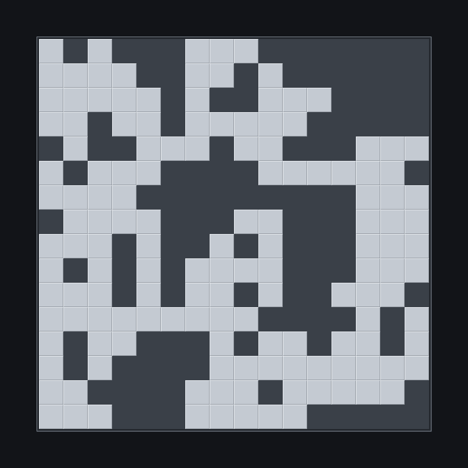
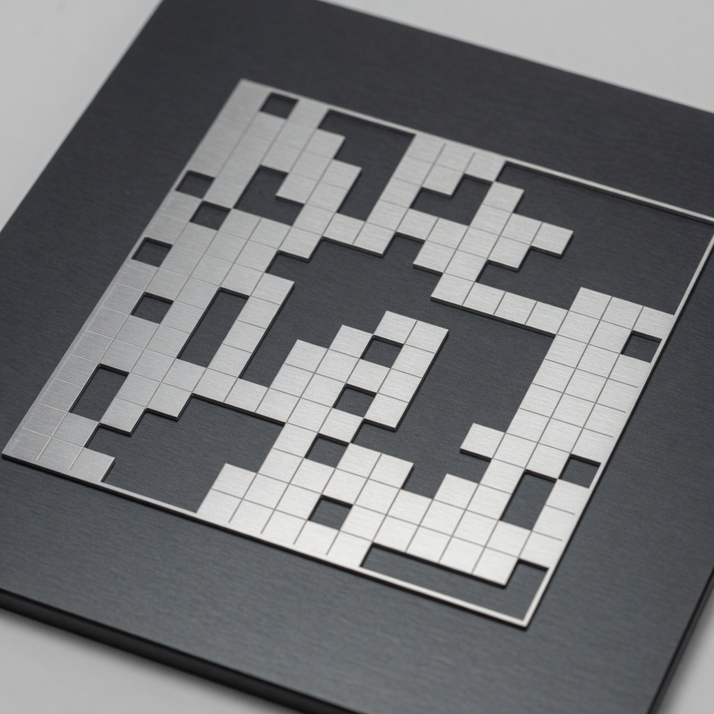

# Evolved Casimir center sheet

Evolved 2026-09-16 16:32:44 UTC.

A genetic algorithm searched binary metal occupancy on a rectangular lattice lying flat between the two 1 µm-anodized plates. Ranking fitness is **⟨P₅₀⟩·A** (mean available thermal power into 50 Ω times metal area) so the search does not collapse to a single cell: raw P₅₀ rises as C falls, while Casimir force scales with area. Power is evaluated at 100 MHz, 433 MHz, 915 MHz, and 2.45 GHz. Span is a gene. The E-shaped seed is the baseline.

| | |
| --- | ---: |
| Grid | 16 × 16 |
| Population / generations | 40 / 60 |
| Mutation | 4% bits / generation |
| Span range | 2.0–120 mm |

## Best sheet

| | |
| --- | ---: |
| Span | **120.00 mm** |
| Fill | **55.9%** (143 cells) |
| Metal area | 8043.750 mm² |
| Mean P(50 Ω) | **-205.17 dBm/Hz** |
| Fitness ⟨P⟩·A | **2.448e-26** W·m²/Hz |
| E-shape baseline P | -207.47 dBm/Hz |
| E-shape baseline ⟨P⟩·A | 3.115e-27 W·m²/Hz |
| Fitness gain | **×7.86** |

Band-by-band available power:

| f | Re(Z) | Im(Z) | P(50 Ω) |
| ---: | ---: | ---: | ---: |
| 100.00 MHz | 0.0182 Ω | -0.00891 Ω | **-202.3 dBm/Hz** |
| 433.00 MHz | 0.0104 Ω | -0.0104 Ω | **-204.7 dBm/Hz** |
| 915.00 MHz | 0.00663 Ω | -0.00893 Ω | **-206.7 dBm/Hz** |
| 2.45 GHz | 0.00236 Ω | -0.00621 Ω | **-211.2 dBm/Hz** |

Plan view (`#` = aluminum, `.` = oxide only):

```
#.#...###.......
####..##.#......
#####.#..###....
##.##.#####.....
.#..###.##...###
#.###....######.
####.........###
.####...##...###
###.#..#.#...###
#.#.#.####...###
###.#.##.#..###.
#########....#.#
#.##...#.##.##.#
#.#....#########
##....###.#####.
###...#####.....
```




